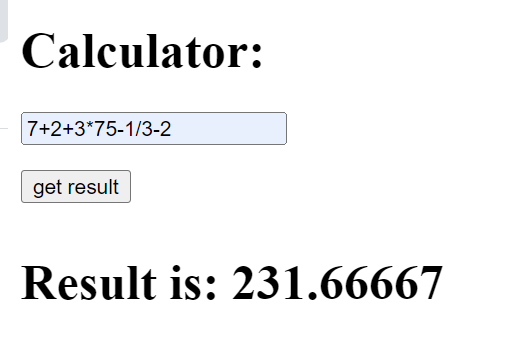

<h1 align="center">Calculator</h1>
----
<p align="center">
</p>

----
## Stack
Java, Spring Boot, Maven, Thymeleaf.
____
## Краткое описание
Данное Spring Boot приложение является простым калькулятором,
основной функциональностью которого являются:
<li>обработка данных, переданных через поле;</li>
<li>вычисление выражения(-, +, /, *).</li>

___
## Работа приложения
### Кнопка get result:
Запуск вычисления выражения;
### RESULT
<details>
<summary>OK</summary> 
Result is: 231.66667
</details>
<details>
<summary>ERROR</summary> 
Result is: Check your input

Result is: Can't divide by zero
</details>

___
## Как запустить
Для работы приложения необходимо:
<li>настроить соединение.</li>

```
server:
  port: 8080
```
____